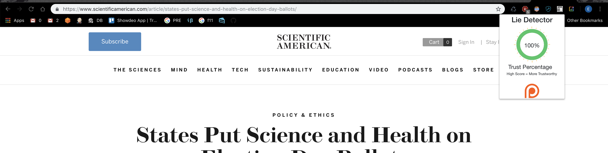

# lie-detector
# Lie-Detector 🛑 Project Sunset Notice (May 2025)

This project has been **officially sunset** and is no longer maintained.  
It remains public as a historical reference to my **1st Place project at the Monterey Bay Hackathon 2018**.

---

## 🏆 What It Was

Lie-Detector was a Chrome extension that:
- Scanned news articles for credibility signals.
- Cross-referenced links against OpenSources.
- Analyzed sentiment using Google's NLP API.
- Displayed a "trust score" in the browser.

---

## 🛠️ Key Technologies
- Chrome Extension APIs
- Node.js companion server
- Google Cloud Natural Language API

---

## 🏅 Award
- **1st Place, Monterey Bay Hackathon 2018**

---

## ⚠️ Status
This project is **no longer maintained**.  
It remains archived as a portfolio artifact.

> Shipped. Learned. Moving on.

## Summary
Chrome extension to inform users about the reliability and credibility of news articles. Lie-detector will
analyze all the links and sources of any webpage, and compare them to [OpenSources](https://github.com/OpenSourcesGroup/opensources), a 
professionally curated lists of online sources. Second, the article's text will be extracted and sent through 
[Google's natural language API](https://cloud.google.com/natural-language/) to analyze the sentiment of an article. 
This search for emotive or biased language. Using both of these sources, a trust score will be displayed in the extension.

## Monterey Bay Hackathon 1st Place
This project was first place in the [Monterey Bay Hackathon 2018](https://csumb.edu/iied/events/startup-monterey-bay-hackathon-2018)

## Getting started.
### Prerequisites
In order to run this extension the companion [node.js server](https://github.com/eshaffer321/lie-detector-api) must be running

### Install
* Download or clone the app
* Open the [chrome extension](chrome://extensions/) page.
* Enable developer options
* Click load unpacked and select the lie-detector folder.

## Examples

### Info Wars

  

  

#### Scientific American

  

  

